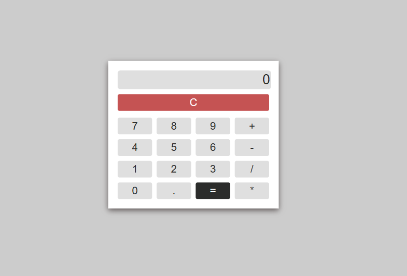
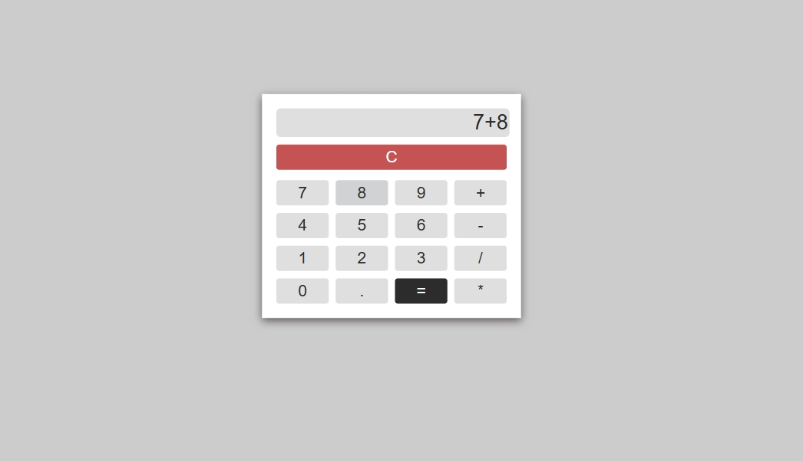
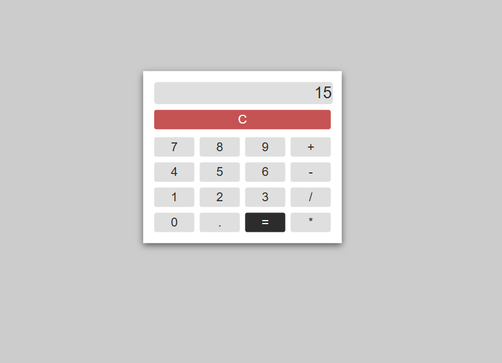

# Calculator

## Overview of Project

Calculator built using **HTML, CSS, and Javascript**, delivering a clean Ul and full functionality for addition, subtraction, multipication, and division.

### Home Page

### Addition Operation

### Result

